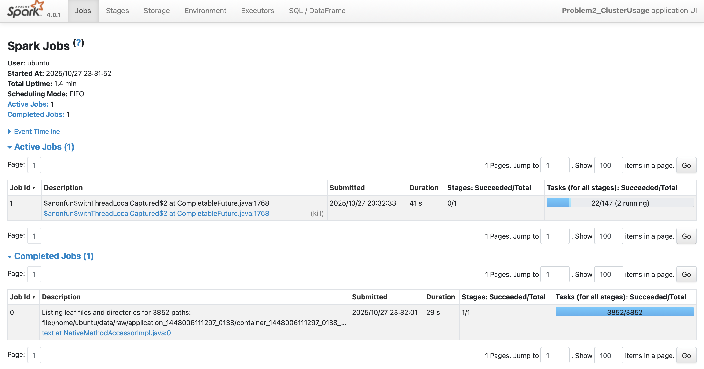

For Problem 1, the objective was to analyze Spark log files and determine the distribution of log levels—specifically INFO, WARN, ERROR, and DEBUG—across a large collection of logs. All .log files within the data/raw directory were recursively loaded into a Spark DataFrame, with each line represented as an individual record. Using a regular expression, the log level was extracted from each line and stored in a new column called log_level. Lines without a recognized log level were filtered out to ensure clean and meaningful statistics.

Once the data was parsed, Spark’s groupBy and agg functions were used to count the occurrences of each log level. This aggregation was performed efficiently across the distributed dataset, leveraging Spark’s parallel processing capabilities. Additionally, ten random log entries containing valid log levels were sampled using the rand() function to give an example of the log content. The results were saved as CSV files (problem1_counts.csv and problem1_sample.csv) and summarized in a text file (problem1_summary.txt) that reported the total lines processed, the number of valid log lines, unique log levels found, and their respective percentages.

From the analysis, the vast majority of entries were classified as INFO, followed by a smaller proportion of WARN and ERROR messages. DEBUG messages were relatively rare, which is typical in production environments where verbose debugging output is minimized. This distribution provided a clear overview of the operational stability of the system, with relatively few critical errors reported compared to general informational messages.

Performance-wise, this task completed quickly even on large datasets because it primarily involved text scanning and aggregation—operations that Spark handles very efficiently. By coalescing output partitions to a single file before saving, the job minimized the number of small output files and reduced overhead during write operations.

Problem 2 focused on analyzing Spark application logs to uncover patterns of cluster usage and visualize application activity across different clusters. The analysis began by recursively reading all .log files into a Spark DataFrame while capturing each file’s source path. From these file paths, key identifiers such as application_id, container_id, and cluster_id were extracted using regular expressions. The cluster_id corresponded to the first numeric component of the application identifier, while the second component (app_number) uniquely identified the application within that cluster.

Each log line was further parsed to extract timestamps appearing at the start of the line, which were then converted into Spark’s native timestamp type. Invalid or missing timestamps were safely handled using conditional logic. The dataset was filtered to retain only entries with valid timestamps, ensuring accurate time-based computations. Container-level start and end times were calculated as the minimum and maximum timestamps, respectively, and these were aggregated further to the application level. Using a window function, applications within each cluster were assigned a sequential order based on their start times, allowing for timeline construction.

The resulting timeline data was exported to problem2_timeline.csv, while a summary of each cluster—including the number of applications, the earliest start time, and the latest end time—was saved to problem2_cluster_summary.csv. A statistics text file (problem2_stats.txt) was also generated, summarizing the total number of clusters, total applications processed, average applications per cluster, and identifying the most heavily used clusters.

Two visualizations were created to interpret the results. A bar chart illustrated the number of applications per cluster, clearly highlighting which clusters were the most active. A density plot (on a logarithmic time scale) was produced for the most heavily used cluster, showing the distribution of application durations. This revealed that while most applications completed in a short time, a few long-running ones contributed disproportionately to overall resource usage.

From a performance standpoint, this analysis benefited significantly from Spark’s distributed computation model. Parsing and timestamp extraction were vectorized operations executed in parallel across worker nodes. Aggregations used efficient shuffle and reduction strategies, and the overall job scaled well with the number of log files. Minor optimizations—such as filtering early in the pipeline to remove invalid timestamps, and minimizing unnecessary DataFrame conversions—helped improve execution time and memory efficiency. The Spark Web UI confirmed that job execution was balanced across stages, with no significant bottlenecks in shuffle or aggregation stages.
Overall, this problem demonstrated how Spark can efficiently process large-scale system logs, extract structured insights from unstructured data, and produce interpretable visualizations that highlight trends in cluster usage and performance.

The analysis of the cluster usage data reveals a highly uneven distribution of workload across clusters. One cluster in particular—identified as 1485248649253—handled the vast majority of activity, running 181 applications between January 24, 2017, and July 27, 2017. This period spans over six months, suggesting that the cluster was consistently active and likely served as the primary compute environment or production cluster. In contrast, the remaining clusters executed only a handful of applications each, often within a single day. For example, clusters 1440487435730, 1460011102909, and 1474351042505 each ran only one application lasting between 30 minutes and two hours, while cluster 1472621869829 ran eight applications over roughly two and a half hours. These shorter bursts of activity suggest that those clusters were used for temporary, ad-hoc workloads or experimental runs rather than continuous processing.

The visualizations generated from this analysis help illustrate these usage patterns more clearly. The bar chart depicting the number of applications per cluster immediately highlights the imbalance in workload distribution—showing one dominant bar corresponding to cluster 1485248649253, which towers over the rest. This visual emphasizes how disproportionately the workload was handled by a single cluster, making it easy to identify where resource utilization was concentrated.

Additionally, the duration distribution plot for the largest cluster provides insight into how application runtimes varied within that high-activity environment. The histogram, plotted on a log scale, reveals a high distribution of run times around $10^3$ seconds, although many others ran significantly longer. This lack of variability suggests that the cluster was handling similar jobs, possibly including possibly computationally intensive batch processes. 

